# SWE_CAP2_Game_Automation

## **Brief Description of the Game and Objectives**

In **The Farmer Was Replaced**, I play as a programmer in charge of automating a farm using a drone. My mission is to write code that instructs the drone to complete various farming tasks, from planting seeds to watering and harvesting crops. As I advance through levels, the challenges become more complex, requiring precise planning and optimization to manage the drone’s actions efficiently. The game combines coding skills with strategic problem-solving, pushing me to refine my automation process for maximum productivity and minimal resource use.

### **Objectives**

1. **Basic Crop Planting and Harvesting**: Guide the drone to plant and harvest crops on a grid according to basic instructions.
2. **Manage Crop-Specific Requirements**: Adhere to special planting rules for each crop, like spacing trees properly to avoid overcrowding.
3. **Optimize Harvesting Sequence**: Harvest crops in a specific order (e.g., largest to smallest for sunflowers) to maximize yield.
4. **Efficient Movement**: Minimize the drone’s travel time across the field with optimized paths and movement loops.
5. **Implement Polyculture**: Plant compatible crop types together to boost farm productivity.
6. **Watering and Fertilizing**: Add timely watering and fertilizing steps to ensure optimal crop growth.
7. **Resource Management**: Use resources like water and fertilizer effectively, reducing waste while ensuring crop health.
8. **Automation Refinement**: Continuously improve the automation process, allowing the drone to operate with minimal manual input.

Through these objectives, I learn to balance efficiency, resource management, and algorithmic problem-solving, while managing the unique needs of a diverse set of crops.

---

## **Table of Contents**
- [Code Snippets and Explanation](#code-snippets-and-explanation)
- [Challenges and Learnings](#challenges-and-learnings)
- [References](#references)

---

# Code Snippets and Explanation

### Step 1: Farming on 1 Tile
---
#### **Code:**

```python
harvest()
```

#### **Explanation:**

The code runs and collects grass up to 5 units, after which the loop unlocks.

---
#### **Demo:**


#### **Code:**

```python
while True:
    if can_harvest():
        harvest()
    else:
        do_a_flip()
```

#### **Explanation:**

This code runs an infinite loop, where the drone harvests grass if possible; otherwise, it performs a flip and continues harvesting.

---

#### **Code:**

```python
while True:
    if can_harvest():
        harvest()
        move(North)
```

#### **Explanation:**

With the grid expanded to `3 x 1`, the drone moves north to harvest the crops and then continues harvesting.

---
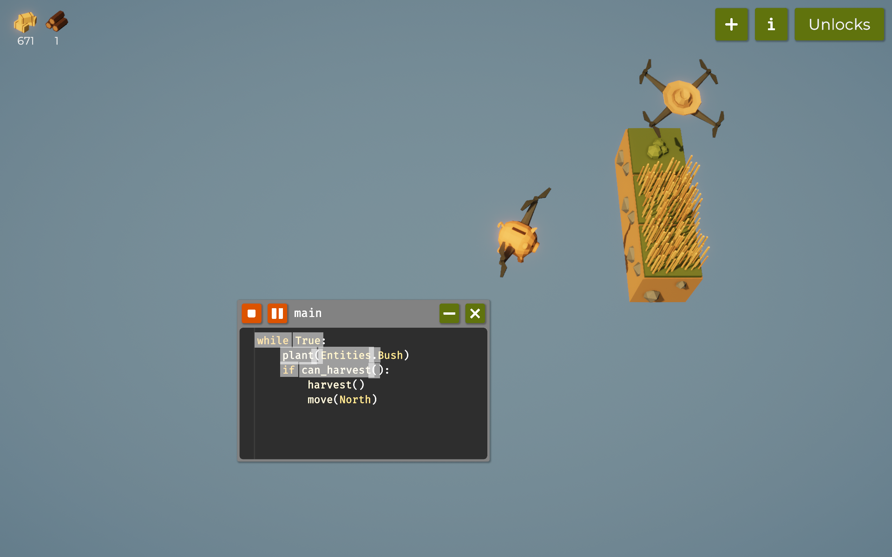

---

#### **Code:**

```python
while True:
    plant(Entities.Bush)
    if can_harvest():
        harvest()
        move(North)
    else:
        move(North)
```

#### **Explanation:**

Here, I plant bushes and harvest both wood and grass alternately. Initially, I faced a challenge with the following code:

----
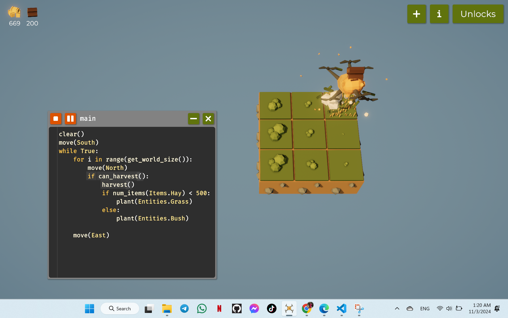

---
```python
while True:
    plant(Entities.Bush)
    if can_harvest():
        harvest()
        move(North)
```

This code caused the drone to wait for bushes to be ready for harvesting, which was time-consuming. I added an `else` statement to move the drone north, allowing it to harvest grass and wood more efficiently.

### **Note:**
---
- Expanded tile size from `1 x 1` to `1 x 3`.
- Unlocked drone speed upgrade.
- Upgraded grass for increased yield.
- Unlocked sensor to detect surroundings.
- Introduced operators for conditional logic.

---

### Step 2: Farming on a `3 x 3` Tile
---
#### **Code:**

```python
clear()
move(South)
while True:
    for i in range(get_world_size()):
        move(North)
        if can_harvest():
            harvest()
            if num_items(Items.Hay) < 500:
                plant(Entities.Grass)
            else:
                plant(Entities.Bush)
    move(East)
```

#### **Explanation:**

With a `3 x 3` farming tile and unlocked loops, I set up the drone to move across the grid. This code checks if hay is less than 500, planting grass if it is. Otherwise, it plants bushes for wood. The `clear()` and `move(South)` commands reset the drone to its starting position before it moves north and east, continuing the harvest.

---
#### **Code:**

```python
clear()
move(South)
while True:
    for i in range(get_world_size()):
        move(North)
        if can_harvest():
            harvest()
            if num_items(Items.Hay) < 600:
                plant(Entities.Grass)
            elif num_items(Items.Wood) < 400:
                plant(Entities.Bush)
            else:
                if num_items(Items.Carrot_Seed) == 0:
                    trade(Items.Carrot_Seed)
                if get_ground_type() == Grounds.Turf:
                    till()
                plant(Entities.Carrots)
    move(East)
```

#### **Explanation:**

This code checks inventory levels and plants accordingly. If there are no carrot seeds, it trades for more. Before planting, it ensures the ground is tilled.

---

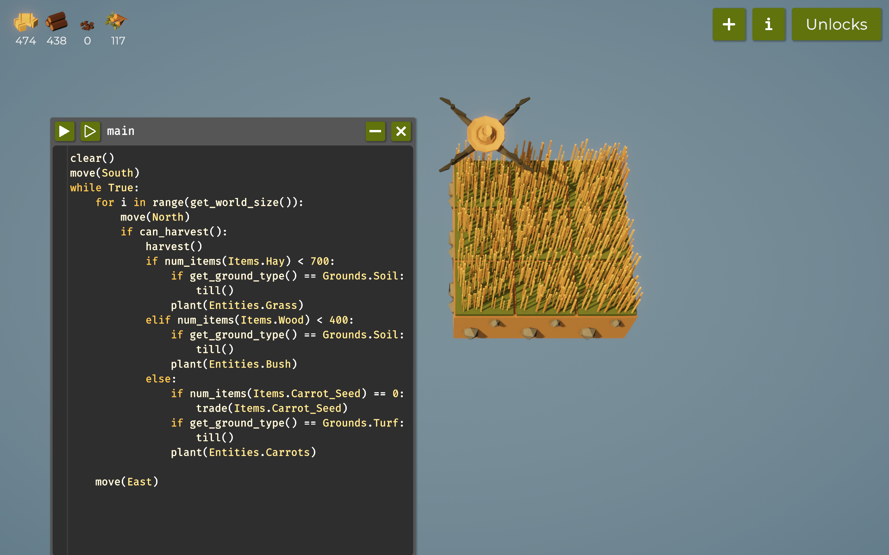

---
#### **Code:**

```python
clear()
move(South)
while True:
    for i in range(get_world_size()):
        move(North)
        if can_harvest():
            harvest()
            if num_items(Items.Water_Tank) < 100:
                trade(Items.Empty_Tank)
            if get_water() < 0.75:
                use_item(Items.Water_Tank)
            if num_items(Items.Hay) < 600:
                if get_ground_type() == Grounds.Soil:
                    till()
                plant(Entities.Grass)
            elif num_items(Items.Wood) < 400:
                if get_ground_type() == Grounds.Soil:
                    till()
                plant(Entities.Bush)
            else:
                if num_items(Items.Carrot_Seed) == 0:
                    trade(Items.Carrot_Seed)
                if get_ground_type() == Grounds.Turf:
                    till()
                plant(Entities.Carrots)
    move(East)
```

#### **Explanation:**

In this version, I added watering functionality. The code checks if the inventory has enough water tanks and ensures the water level is above 75%. If not, it uses a water tank. This keeps crops healthy without wasting water.

---
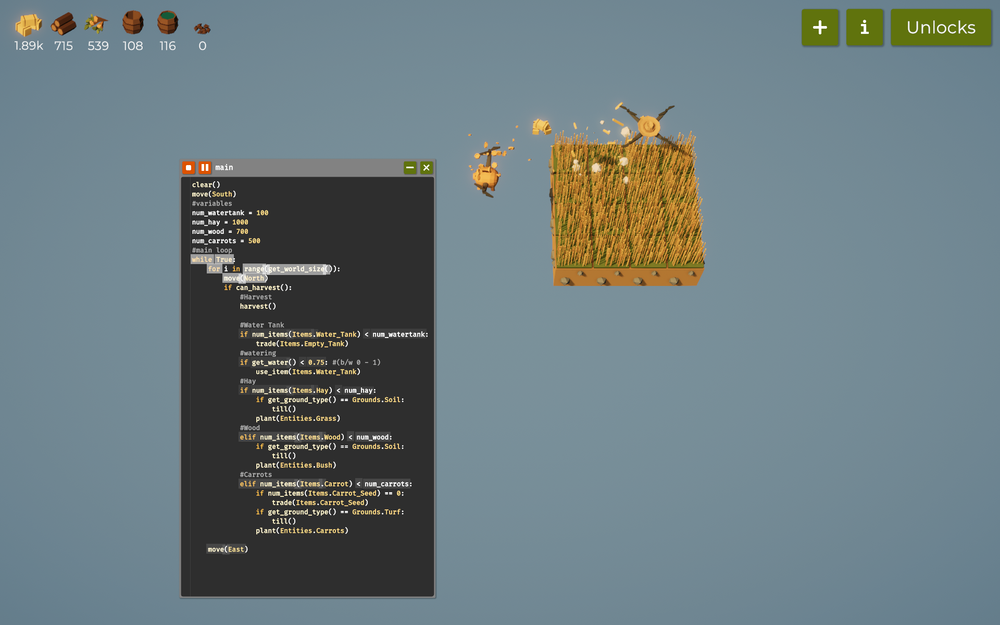

---
#### **Code:**

```python
clear()
move(South)
# Variables
num_watertank = 100
num_hay = 600
num_wood = 400
num_carrots = 100
# Main Loop
while True:
    for i in range(get_world_size()):
        move(North)
        if can_harvest():
            harvest()
            if num_items(Items.Water_Tank) < num_watertank:
                trade(Items.Empty_Tank)
            if get_water() < 0.75:
                use_item(Items.Water_Tank)
            if num_items(Items.Hay) < num_hay:
                if get_ground_type() == Grounds.Soil:
                    till()
                plant(Entities.Grass)
            elif num_items(Items.Wood) < num_wood:
                if get_ground_type() == Grounds.Soil:
                    till()
                plant(Entities.Bush)
            elif num_items(Items.Carrot) < num_carrots:
                if num_items(Items.Carrot_Seed) == 0:
                    trade(Items.Carrot_Seed)
                if get_ground_type() == Grounds.Turf:
                    till()
                plant(Entities.Carrots)
    move(East)
```

#### **Explanation:**

Here, I used variables to track the number of items I want to maintain in my inventory.

---
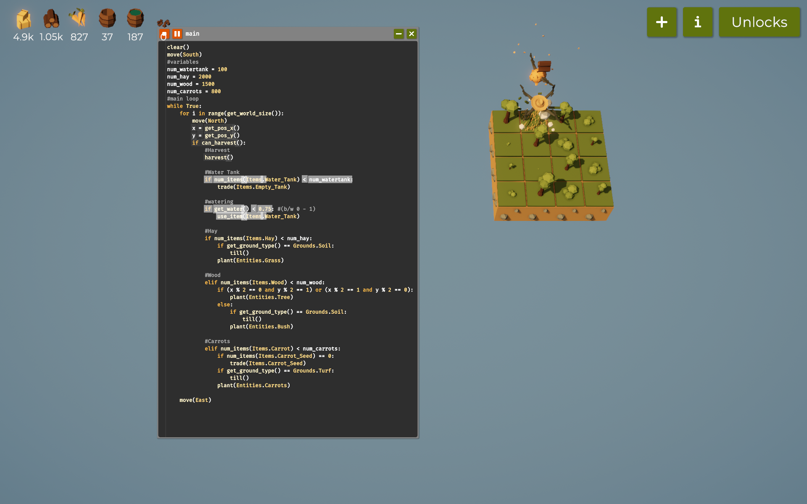

---
### **Note:**
- Carrots unlocked.
- Variable usage unlocked to manage items.
- Watering functionality unlocked.

---


## Step 4: Farming on `4 x 4` Tile

### **Code:**
```python
clear()
move(South)
# Variables
num_watertank = 100
num_hay = 2000
num_wood = 1000
num_carrots = 800
# Main loop
while True:
    for i in range(get_world_size()):
        move(North)
        x = get_pos_x()
        y = get_pos_y()
        if can_harvest():
            # Harvest
            harvest()
            
            # Water Tank
            if num_items(Items.Water_Tank) < num_watertank:
                trade(Items.Empty_Tank)
                
            # Watering
            if get_water() < 0.75:
                use_item(Items.Water_Tank)
                
            # Hay
            if num_items(Items.Hay) < num_hay:
                if get_ground_type() == Grounds.Soil:
                    till()
                plant(Entities.Grass)
                
            # Wood
            elif num_items(Items.Wood) < num_wood:
                if (x % 2 == 0 and y % 2 == 1) or (x % 2 == 1 and y % 2 == 0):
                    plant(Entities.Tree)
                else:
                    if get_ground_type() == Grounds.Soil:
                        till()
                    plant(Entities.Bush)
    
            # Carrots
            elif num_items(Items.Carrot) < num_carrots:
                if num_items(Items.Carrot_Seed) == 0:
                    trade(Items.Carrot_Seed)
                if get_ground_type() == Grounds.Turf:
                    till()
                plant(Entities.Carrots)
    
    move(East)
```

### **Explanation:**
In this code, I included a way to plant trees in a checkerboard pattern to optimize wood yield. Using `get_pos_x()` and `get_pos_y()`, I identify grid positions to alternate between planting trees and bushes in a checkerboard pattern, ensuring optimal spacing for tree growth.

---
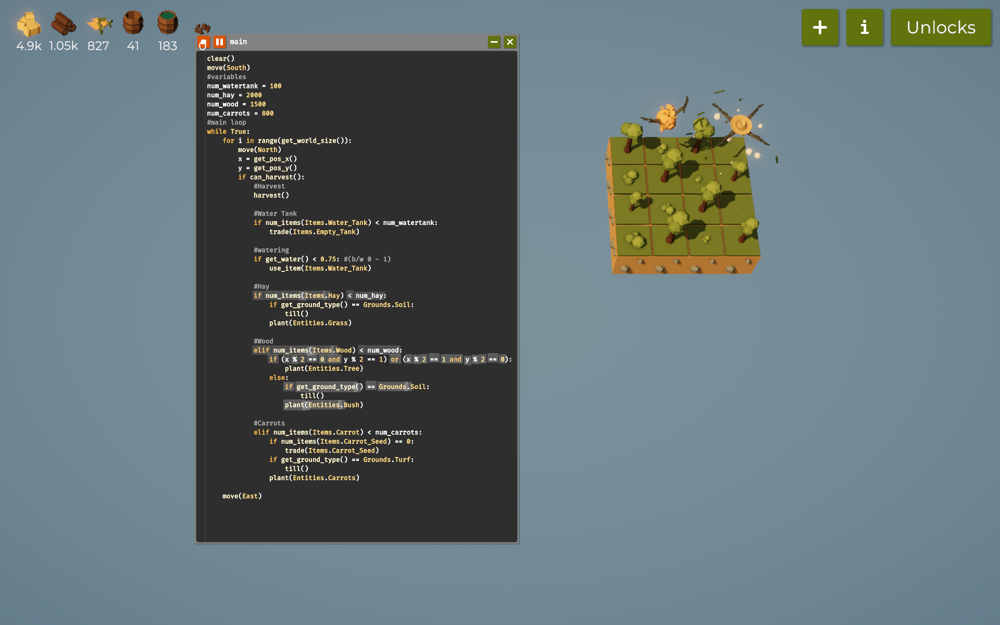

---

**Main Function**
```python
clear()
move(South)
# Variables
num_watertank = 100
num_hay = 7000
num_wood = 4000
num_carrots = 3000
# Main loop
while True:
    for i in range(get_world_size()):
        move(North)
        x = get_pos_x()
        y = get_pos_y()
        if can_harvest():
            # Harvest
            harvest()
            
            # Watering
            watering()
            
            # Planting
            planting()
    
    # Next Row
    move(East)
```

**Planting Function**
```python
def planting():
    # Hay
    if num_items(Items.Hay) < num_hay:
        if get_ground_type() == Grounds.Soil:
            till()
        plant(Entities.Grass)
                
    # Wood
    elif num_items(Items.Wood) < num_wood:
        if (x % 2 == 0 and y % 2 == 1) or (x % 2 == 1 and y % 2 == 0):
            plant(Entities.Tree)
        else:
            if get_ground_type() == Grounds.Soil:
                till()
            plant(Entities.Bush)
    
    # Carrots
    elif num_items(Items.Carrot) < num_carrots:
        if num_items(Items.Carrot_Seed) == 0:
            trade(Items.Carrot_Seed, 5)
        if get_ground_type() == Grounds.Turf:
            till()
        plant(Entities.Carrots)
```

**Watering Function**
```python
def watering():
    # Water Tank
    if num_items(Items.Water_Tank) < num_watertank:
        trade(Items.Empty_Tank, 5)
    # Watering
    if get_water() < 0.75:
        use_item(Items.Water_Tank)
```

### **Explanation:**
With the functions feature unlocked, I separated `planting` and `watering` into standalone functions for cleaner, more modular code. Using `multi-trade`, I traded for seeds and water tanks in batches of 5 for efficiency. This keeps the inventory adequately stocked without interrupting farming tasks.

---
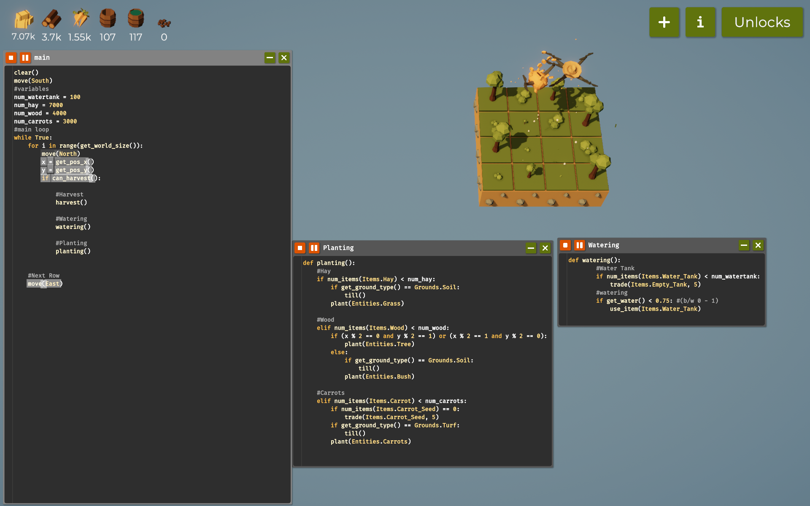

---
### **Expanded Code with New Crops: Sunflowers and Pumpkins**

```python
clear()
do_a_flip()
move(South)
# Variables
num_watertank = 100
num_hay = 10000
num_wood = 6000
num_carrots = 5000
num_pumpkins = 600
# Main loop
while True:
    for i in range(get_world_size()):
        move(North)
        x = get_pos_x()
        y = get_pos_y()
        if can_harvest():
            # Harvest
            harvest()
            
            # Watering
            watering()
            
            # Planting
            planting()
        else:
            if get_ground_type() == Grounds.Soil:
                till()
                
    # Next Row
    move(East)
```

**Updated Planting Function**
```python
def planting():
    # Sunflower
    if x == 0 and y == 0:
        if num_items(Items.Sunflower_Seed) == 0:
            trade(Items.Sunflower_Seed, 5)
        if get_ground_type() == Grounds.Turf:
            till()
        plant(Entities.Sunflower)
        
    # Hay
    elif num_items(Items.Hay) < num_hay:
        if get_ground_type() == Grounds.Soil:
            till()
        plant(Entities.Grass)
                
    # Wood
    elif num_items(Items.Wood) < num_wood:
        if (x % 2 == 0 and y % 2 == 1) or (x % 2 == 1 and y % 2 == 0):
            plant(Entities.Tree)
        else:
            if get_ground_type() == Grounds.Soil:
                till()
            plant(Entities.Bush)
    
    # Carrots
    elif num_items(Items.Carrot) < num_carrots:
        if num_items(Items.Carrot_Seed) == 0:
            trade(Items.Carrot_Seed, 5)
        if get_ground_type() == Grounds.Turf:
            till()
        plant(Entities.Carrots)
    
    # Pumpkins
    elif num_items(Items.Pumpkin) < num_pumpkins:
        if num_items(Items.Pumpkin_Seed) == 0:
            trade(Items.Pumpkin_Seed, 5)
        if get_ground_type() == Grounds.Turf:
            till()
        plant(Entities.Pumpkin)
```

### **Explanation:**
#### Sunflower Planting:
- Sunflowers are planted at `(x == 0 and y == 0)`, which designates a fixed location for them. The drone checks if there are enough sunflower seeds; if not, it trades for 5 more. The ground is tilled only if it’s turf, ensuring optimal growth conditions.

#### Pumpkin Planting:
- The code checks if there are fewer than 600 pumpkins. If needed, it trades for pumpkin seeds, ensures the ground is tilled, and plants pumpkins in any location meeting these criteria.

---
### **Notes:**
1. **New Functionalities Unlocked:**
   - Tree and Function definitions using `def`.
   - Enhanced carrot and tree yield (300% for carrots and 400% for trees).
   - Multi-trade, allowing bulk trades for seeds and water tanks.

2. **Overall Benefits:**
   - Cleaner code with functions.
   - Efficient, checkerboard tree planting.
   - Sufficient resource management for diverse crop requirements. 


---
## Step 5: Farming on `5 x 5` tile

### **Code:**
```python
clear()
do_a_flip()
move(South)
#variables
num_watertank = 100
num_hay = 20000
num_wood = 16000
num_carrots = 1400
num_pumpkins = 10000
#main loop
while True:
	for i in range(get_world_size()):
		move(North)
		x = get_pos_x()
		y = get_pos_y()
		if can_harvest():
			
			#Harvest
			harvest()
			
			#Watering
			watering()
			
			#Planting
			planting()
		else:
			if get_ground_type() == Grounds.Soil:
				till()
				
	#Next Row
	move(East)


def planting():
	#Sunflower
	if x == 0 and y == 0:
		if num_items(Items.Sunflower_Seed) == 0:
			trade(Items.Sunflower_Seed, 5)
		if get_ground_type() == Grounds.Turf:
			till()
		plant(Entities.Sunflower)
		
	#Hay
	elif num_items(Items.Hay) < num_hay:
		if get_ground_type() == Grounds.Soil:
			till()
		plant(Entities.Grass)
				
	#Wood
	elif num_items(Items.Wood) < num_wood:
		if (x % 2 == 0 and y % 2 == 1) or (x % 2 == 1 and y % 2 == 0):
			plant(Entities.Tree)
		else:
			if get_ground_type() == Grounds.Soil:
				till()
			plant(Entities.Bush)
	
	#Carrots
	elif num_items(Items.Carrot) < num_carrots:
		if num_items(Items.Carrot_Seed) == 0:
			trade(Items.Carrot_Seed, 5)
		if get_ground_type() == Grounds.Turf:
			till()
		plant(Entities.Carrots)
		
	
	#Pumpkins
	elif num_items(Items.Pumpkin) < num_pumpkins:
		if num_items(Items.Pumpkin_Seed) == 0:
			trade(Items.Pumpkin_Seed, 5)
		if get_ground_type() == Grounds.Turf:
			till()
		plant(Entities.Pumpkin)


def watering():
		#Water Tank
		if num_items(Items.Water_Tank) < num_watertank:
			trade(Items.Empty_Tank, 5)
		#watering
		if get_water() < 0.75: #(b/w 0 - 1)
			use_item(Items.Water_Tank)
```


---
### **Note:**

In this step, where the farming tile is `5 x 5`, I just used the same code of the previous step by increasing the speed of the drone and yield of the entities so that I can unlock other important functions to farm. 

---
## Step 6: Farming on `6 x 6` tile

### **Code:**
```python
#main loop
while True:
	for i in range(get_world_size()):
		#buy stuff
		if num_items(Items.Sunflower_Seed) < 100:
			trade(Items.Sunflower_Seed, get_world_size())
		if num_items(Items.Carrot_Seed) < 100:
			trade(Items.Carrot_Seed, get_world_size())
		if num_items(Items.Pumpkin_Seed) < 100:
			trade(Items.Pumpkin_Seed, get_world_size())
			
		move(North)
		x = get_pos_x()
		y = get_pos_y()
		if can_harvest():
			
			#Harvest
			harvest()
			
			#Watering
			watering()
			
			#Planting
			planting()
		else:
			if get_ground_type() == Grounds.Soil:
				till()
```

### **Explanation:**

In this part of my code, I added the new code to buy seeds to make sure I always have enough seeds for planting sunflowers, carrots, and pumpkins on the farm. I’ve set it up so that if I have fewer than 100 of any type of seed, the code will automatically trade for more. I use `get_world_size()` to decide how many seeds to buy, which means the amount I buy is based on the size of the area I’m managing. This way, I have enough seeds to cover the entire farm without going overboard and using up too much inventory space.

This keeps my farm’s planting process smooth and efficient, so I don’t have to worry about running out of seeds and interrupting the automation. It’s all about making sure my resources are in balance, letting me focus on optimizing other parts of my farm.


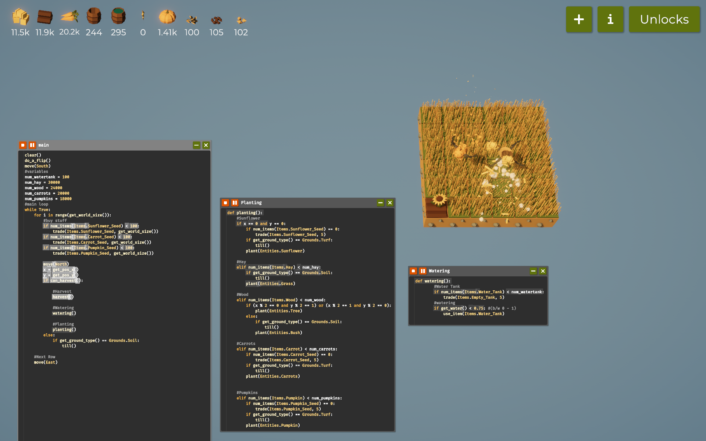
### **Note:**

- I maxed the upgrade level for `Grass`, `Trees` and `Carrots` which helped a lot in increasing the yield for hay, wood and carrots. 
- Now I expanded my farm size to `7 x 7` to harvest more sunflower for more power to speed up the drone.

---
## Step 7: Farming on `7 x 7` tile

### **Code:**
```python
clear()
do_a_flip()
move(South)

# variables
num_watertank = 100
num_hay = 40000
num_wood = 35000
num_carrots = 35000
num_pumpkins = 20000
num_power = 1000

pedalList = list()
# Main loop
while True:
	for i in range(get_world_size()):
		# Buy seeds if needed
		if num_items(Items.Sunflower_Seed) < 100:
			trade(Items.Sunflower_Seed, get_world_size())
		if num_items(Items.Carrot_Seed) < 100:
			trade(Items.Carrot_Seed, get_world_size())
		if num_items(Items.Pumpkin_Seed) < 100:
			trade(Items.Pumpkin_Seed, get_world_size())
			
		move(North)
		x = get_pos_x()
		y = get_pos_y()

		# Harvest Sunflowers
		if can_harvest():
			if get_entity_type() == Entities.Sunflower:
				if measure() == max(pedalList):
					harvest()
					pedalList.remove(max(pedalList))
			else:
				# Harvest, Water, and Plant
				harvest()
				watering()
				planting()
		else:
			if get_ground_type() == Grounds.Soil:
				till()
				
	# Move to the next row
	move(East)
```

### **Explanaton:**
---
In this part of the code, I’m using `pedalList` as a way to keep track of my sunflowers’ progress. Every time I plant a sunflower, I immediately measure it using `measure()` and add that value to `pedalList`. This gives me a list of all my sunflowers’ growth levels, which helps me know which ones are ready for harvesting. 

When I come across a sunflower that can be harvested, I only harvest it if its growth level matches the highest value in `pedalList` —meaning it’s one of the most mature in the field. After I harvest it, I remove its measurement from `pedalList`, so my list stays up-to-date with the sunflowers I have left. This way, I’m maximizing yield by only picking the most fully-grown sunflowers!

---
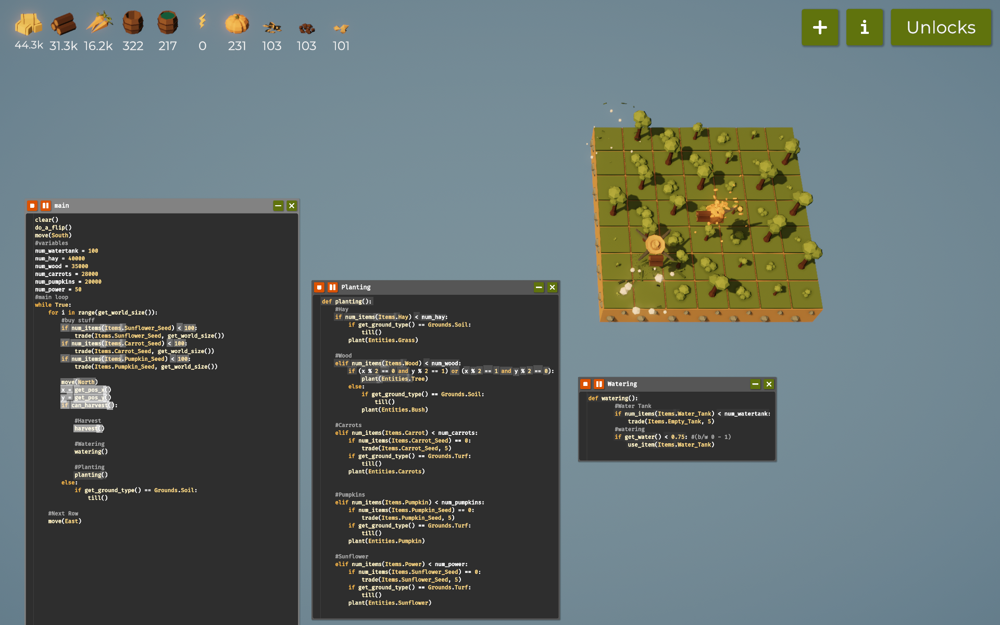

---

### **Note:**
---
- Unlocked utilities so that I can use `min()`, `max()`, `abs()` and `random()` functions. 
- In this step I focused mainly on what I want to track, which are;
    *  Position of the `Drone`
    * Position of the `Sunflower` with the most petals to yield more power

---
## Step 8: Farming on `9 x 9` tile

### **Code:**
```python
clear()
do_a_flip()
move(South)

# variables
num_watertank = 100
num_hay = 40000
num_wood = 45000
num_carrots = 45000
num_pumpkins = 40000
num_power = 3500

pedalList = list()
# Main loop
while True:
	for i in range(get_world_size()):
		#buy stuffs
		buying()
		#move
		move(North)
		x = get_pos_x()
		y = get_pos_y()
		#Harvesting and watering
		harvesting()
		
	# Move to the next row
	move(East)

def harvesting():
	# Harvest Sunflowers
		if can_harvest():
			if get_entity_type() == Entities.Sunflower:
				if measure() == max(pedalList):
					harvest()
					pedalList.remove(max(pedalList))
			else:
				# Harvestand Plant
				harvest()
				planting()
			# Use water if water level is below 75%
			if get_water() < 0.8:
				use_item(Items.Water_Tank)
		else:
			if get_ground_type() == Grounds.Soil:
				till()

def planting():
	# Sunflower
	if num_items(Items.Power) < num_power:
		if get_ground_type() == Grounds.Turf:
			till()
		plant(Entities.Sunflower)
		pedalList.append(measure())
	
	# Hay 
	elif num_items(Items.Hay) < num_hay:
		if get_ground_type() == Grounds.Soil:
			till()
		plant(Entities.Grass)
				
	# Wood 
	elif num_items(Items.Wood) < num_wood:
		if (x % 2 == 0 and y % 2 == 1) or (x % 2 == 1 and y % 2 == 0):
			plant(Entities.Tree)
		else:
			if get_ground_type() == Grounds.Soil:
				till()
			plant(Entities.Bush)
	
	# Carrots
	elif num_items(Items.Carrot) < num_carrots:
		if num_items(Items.Carrot_Seed) == 0:
			trade(Items.Carrot_Seed, 5)
		if get_ground_type() == Grounds.Turf:
			till()
		plant(Entities.Carrots)
		
	# Pumpkins
	elif num_items(Items.Pumpkin) < num_pumpkins:
		if num_items(Items.Pumpkin_Seed) == 0:
			trade(Items.Pumpkin_Seed, 5)
		if get_ground_type() == Grounds.Turf:
			till()
		plant(Entities.Pumpkin)


def watering():
	# Check water tank inventory and refill if low
	if num_items(Items.Water_Tank) < num_watertank:
		trade(Items.Empty_Tank, 5)
	

def buying():
	# Buy seeds if needed
		if num_items(Items.Sunflower_Seed) < 100:
			trade(Items.Sunflower_Seed, get_world_size())
		if num_items(Items.Carrot_Seed) < 100:
			trade(Items.Carrot_Seed, get_world_size())
		if num_items(Items.Pumpkin_Seed) < 100:
			trade(Items.Pumpkin_Seed, get_world_size())
		if num_items(Items.Fertilizer) < 100:
			trade(Items.Fertilizer, get_world_size())
```
---
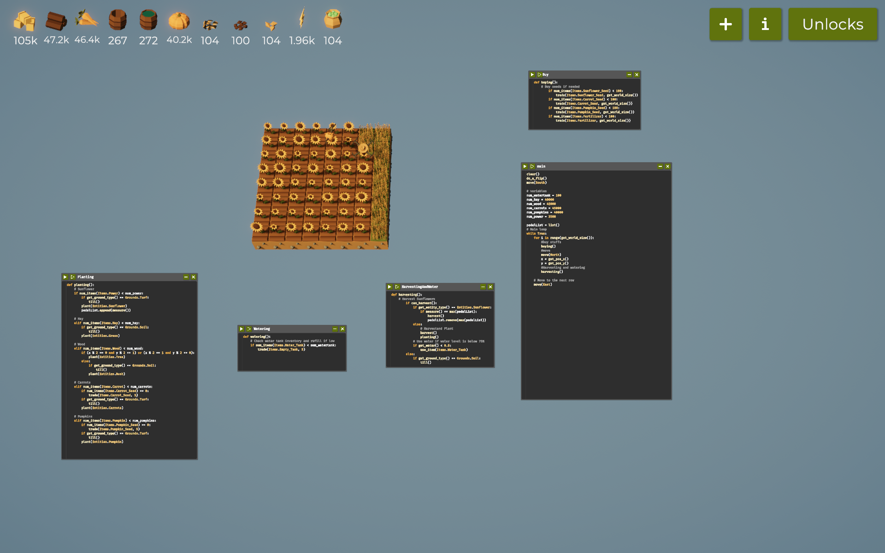

----
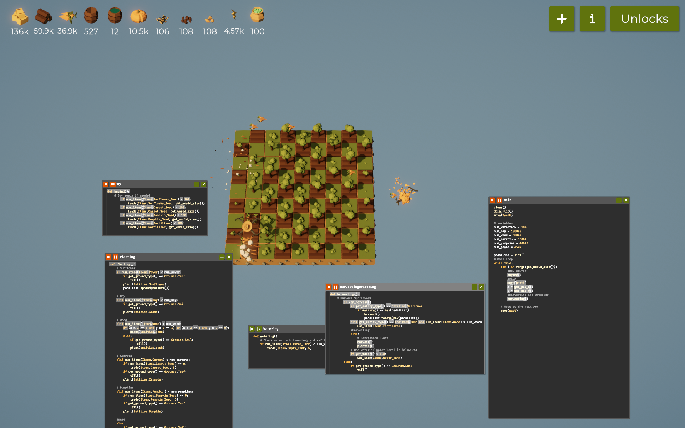

---
### **Note:**
---
- This code is updated code where I grouped the planting functions all in the new function called `harvesting`.
- Here I tried to farm as much as possible and upgraded everything I can from the yield of my harvest.
- In order to collect more resources so I need to expand the size to `9 x 9` from `7 x 7`

---
## Step 9: Farming on `10 x 10` tile

### **Code:**
```python
clear()
do_a_flip()
move(South)

# variables
num_watertank = 100
num_hay = 100000
num_wood = 60000
num_carrots = 60000
num_pumpkins = 80000
num_power = 200

pedalList = list()
# Main loop
while True:
	for i in range(get_world_size()):
		#buy stuffs
		buying()
		#move
		move(North)
		x = get_pos_x()
		y = get_pos_y()
		#Harvesting and watering
		harvesting()
		
	# Move to the next row
	move(East)


def harvesting():
	# Harvest Sunflowers
		if can_harvest():
			if get_entity_type() == Entities.Sunflower:
				if measure() == max(pedalList):
					harvest()
					pedalList.remove(max(pedalList))
			#create maze
			elif get_entity_type() == Entities.Bush and num_items(Items.Wood) > num_wood:
				use_item(Items.Fertilizer)
			#solve the maze
			elif get_entity_type() == Entities.Hedge:
				SolveMaze()
			#Harvesting
			else:
				# Harvestand Plant
				harvest()
				planting()
			# Use water if water level is below 75%
			if get_water() < 0.8:
				use_item(Items.Water_Tank)
		else:
			if get_ground_type() == Grounds.Soil:
				till()


def planting():
	# Sunflower
	if num_items(Items.Power) < num_power:
		if get_ground_type() == Grounds.Turf:
			till()
		plant(Entities.Sunflower)
		pedalList.append(measure())
	
	# Hay 
	elif num_items(Items.Hay) < num_hay:
		if get_ground_type() == Grounds.Soil:
			till()
		plant(Entities.Grass)
				
	# Wood 
	elif num_items(Items.Wood) < num_wood:
		if (x % 2 == 0 and y % 2 == 1) or (x % 2 == 1 and y % 2 == 0):
			plant(Entities.Tree)
		else:
			if get_ground_type() == Grounds.Soil:
				till()
			plant(Entities.Bush)
	
	# Carrots
	elif num_items(Items.Carrot) < num_carrots:
		if num_items(Items.Carrot_Seed) == 0:
			trade(Items.Carrot_Seed, 5)
		if get_ground_type() == Grounds.Turf:
			till()
		plant(Entities.Carrots)
		
	# Pumpkins
	elif num_items(Items.Pumpkin) < num_pumpkins:
		if num_items(Items.Pumpkin_Seed) == 0:
			trade(Items.Pumpkin_Seed, 5)
		if get_ground_type() == Grounds.Turf:
			till()
		plant(Entities.Pumpkin)
		
	#maze
	else:
		if get_ground_type() == Grounds.Soil:
			till()
		plant(Entities.Bush)
		

def buying():
	# Buy seeds if needed
		if num_items(Items.Sunflower_Seed) < 100:
			trade(Items.Sunflower_Seed, get_world_size())
		if num_items(Items.Carrot_Seed) < 100:
			trade(Items.Carrot_Seed, get_world_size())
		if num_items(Items.Pumpkin_Seed) < 100:
			trade(Items.Pumpkin_Seed, get_world_size())
		if num_items(Items.Fertilizer) < 100:
			trade(Items.Fertilizer, get_world_size())
	

def watering():
	# Check water tank inventory and refill if low
	if num_items(Items.Water_Tank) < num_watertank:
		trade(Items.Empty_Tank, 5)
	


def SolveMaze():
	direction = North
	while get_entity_type() != Entities.Treasure:
		direction = TurnLeft(direction)
		if move(direction) == False:
			direction = TurnRight(direction)
		if move(direction) == False:
			direction = TurnRight(direction)
		else:
			direction = TurnLeft(direction)
			if move(direction) == False:
				direction = TurnRight(direction)
				
	harvest()


def TurnRight(direction):
	if direction == North:
		return East
	elif direction == East:
		return South
	elif direction == South:
		return West
	else:
		return North
	
def TurnLeft(direction):
	if direction == North:
		return West
	elif direction == West:
		return South
	elif direction == South:
		return East
	else:
		return North
```

### **Explanation:**
---
In this code, I’m navigating a maze to reach a treasure. The function `SolveMaze()` and the helper functions `TurnRight()` and `TurnLeft()` handle my movement through the maze by adjusting my direction and ensuring I can reach the goal. Let’s break down each part.

#### `SolveMaze()`

1. **Starting Direction**:
   - I set my initial direction to `North`. This will be my reference point as I move.

2. **Looping Through the Maze**:
   - The loop keeps running until I reach the treasure (when `get_entity_type() == Entities.Treasure`), which will break out of the loop once found.
   - Inside the loop, I try moving forward by turning left first, following a left-hand rule for the maze.

3. **Checking for Movement**:
   - I first turn left (calling `TurnLeft()`), and if moving in that direction isn’t possible (`move(direction) == False`), I switch to turning right to find an alternative route.
   - If turning right also doesn’t work, I try turning right again. If still stuck, I turn left once more as a last option.
   - This sequence ensures I try every possible option for moving forward, following walls on my left side until I reach the treasure.

### `TurnRight()` and `TurnLeft()`

- **Turning Right**:
   - `TurnRight(direction)` takes my current direction and updates it by rotating 90 degrees clockwise. 
   - For example, if I’m facing North and turn right, I’ll be facing East, then South, and so on, cycling through each direction.
   
- **Turning Left**:
   - `TurnLeft(direction)` rotates my direction 90 degrees counterclockwise.
   - For instance, if I’m facing North and turn left, I’ll end up facing West, then South, and so forth.


With these functions, I’m able to navigate the maze by continuously adjusting my direction and moving along the walls, ensuring I systematically explore all paths until I find the treasure. The left-hand rule, along with checking both left and right turns, helps me avoid getting stuck and ensures I’ll eventually reach my goal.

---
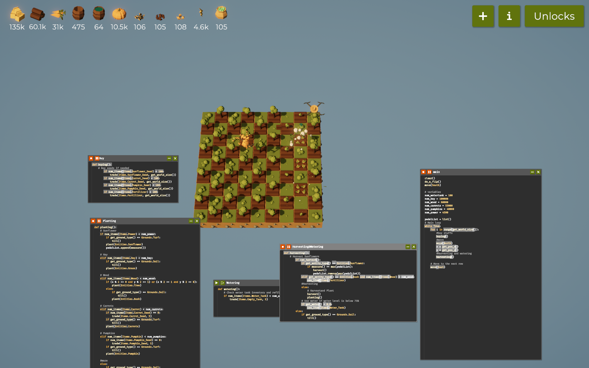

---
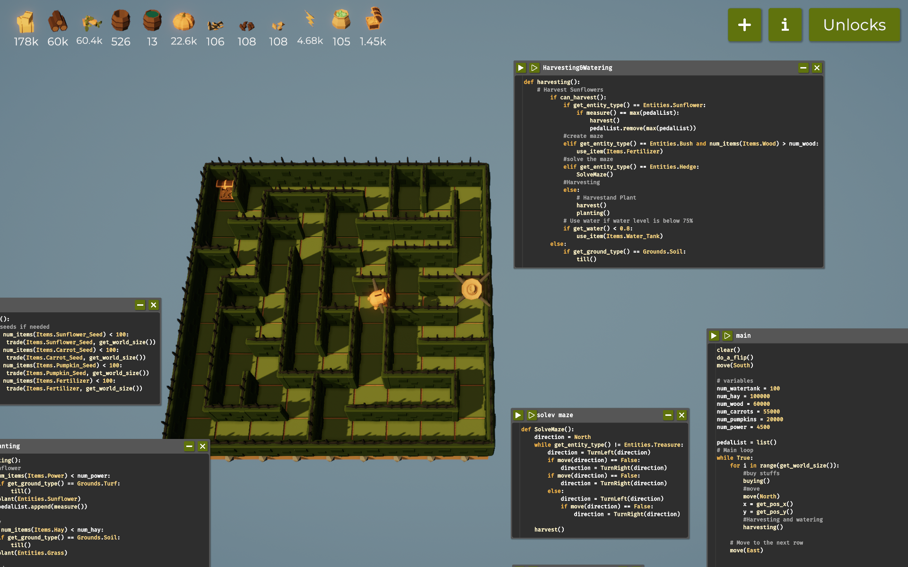
---
### **Code:**
```python
# Cactus
	elif num_items(Items.Pumpkin) < num_cactus:
		if num_items(Items.Cactus_Seed) == 0:
			trade(Items.Cactus_Seed, 5)
		if get_ground_type() == Grounds.Turf:
			till()
		plant(Entities.Cactus)
```

### **Explanation:**
---

In this code section, I attempted to plant cactus entities in my farm. Some of the steps here are;

1. **Check Pumpkin Count**: First, I use `elif num_items(Items.Pumpkin) < num_cactus` to ensure that I only proceed with planting if the number of pumpkins is below the target count for cacti. Although it currently checks `Items.Pumpkin`, this might be an error, and it should likely be `Items.Cactus`.

2. **Trade for Cactus Seeds**: Next, if I don’t have any cactus seeds (checked with `num_items(Items.Cactus_Seed) == 0`), I use `trade(Items.Cactus_Seed, 5)` to trade for 5 seeds to ensure I have enough for planting. This step ensures I don’t run out of seeds and is key to maintaining the cactus planting routine.

3. **Prepare the Ground**: If the ground type is `Turf`, which is suitable for cactus, I till the ground by calling `till()`. This step makes sure the soil is properly prepared for cactus growth. If the ground isn’t `Turf`, I might need to reconsider planting cacti here.

4. **Plant the Cactus**: Finally, I call `plant(Entities.Cactus)`, which attempts to place a cactus in the current position on the farm tile. 

This setup allows me to manage cactus planting based on inventory, ground type, and seed availability. The logic covers various checks to ensure the planting action is carried out only when the right conditions are met.


### **Note:**
---
- I upgraded the mazes to max level
- I unlocked `Benchmark` and `Debug_2` which helps in measuring the performance
- I unlocked the `Costs` and `Cactus` spending the gold I got from harvesting the treasure from `Maze`
- For the expansion of our farming tile, it is upto `10 x 10` tile
- I maxed out the `Speed`, `Pumpkins`, and `sunflower`
- I unlocked one of the interesting function which is the `Auto_Unlock` which automatically unlocks things.

---
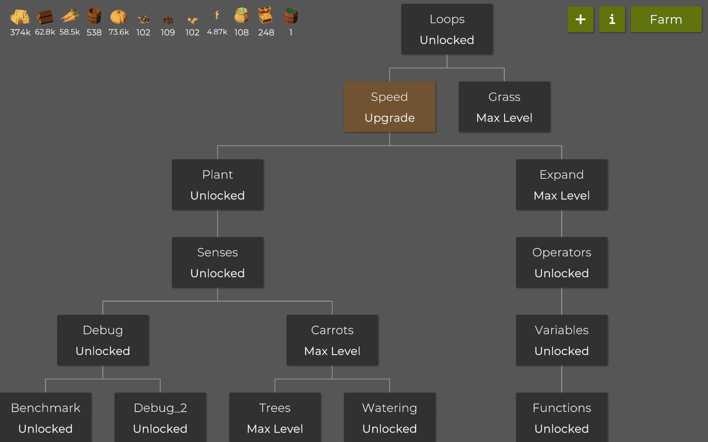

---

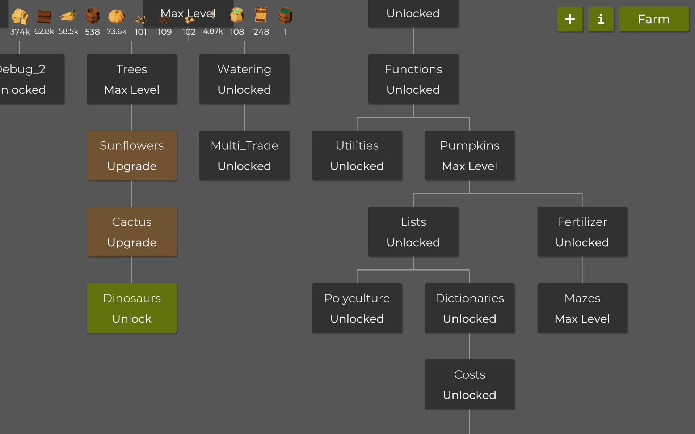

---
# Challenges-and-Learnings
## Challenges I faced
In this game, each stage presented its own set of unique challenges. Here’s a rundown of the main obstacles I faced:

1. **Harvesting Sunflowers**:
   - Sunflowers were tricky to harvest because they needed to be fully matured, and I had to track each one’s growth. I used a list (`pedalList`) to keep track of each sunflower’s growth level by adding a “measure” value for each planted sunflower. This allowed me to know when a sunflower reached its maximum growth, but it required constant attention to make sure I wasn’t harvesting too early. If I missed updating this list accurately, I’d end up with smaller yields and wasted resources.

2. **Managing Power Levels**:
   - Maintaining sufficient power was essential for farming. Planting and harvesting, as well as navigating the maze, required power, and balancing this resource with the seeds and water tank levels was critical. Running out of power mid-task could interrupt progress, especially when I had several sunflowers or other crops to tend to. 

3. **Tilling the Ground**:
   - Tilling required more precision than expected. Certain crops could only grow in specific ground types (like turf for sunflowers and carrots), and I had to ensure the soil was correctly prepared before planting. If I failed to till correctly, seeds wouldn’t take, and I’d have to start over on that patch of ground. Timing tilling operations with planting was essential for a steady crop cycle.

4. **Navigating the Maze**:
   - The maze was one of the most complex parts of the game. Using the `SolveMaze()` function, I navigated with a left-hand rule approach, carefully choosing each direction and testing each route to avoid dead ends. This required a methodical approach and patience, especially when encountering obstacles like bushes, which I could fertilize to create paths, or hedges that added to the challenge.


## Learnings
   Through the challenges in this game, I’ve gained valuable insights and built a strong foundation in Python programming:

1. **Understanding Conditional Logic**:
   - Navigating the maze with directional functions (`TurnLeft`, `TurnRight`, and `SolveMaze`) taught me how to structure and implement conditional statements. I had to decide on specific actions based on conditions like the current direction or entity type. This practical use of `if` statements has deepened my understanding of logical flow in Python.

2. **Working with Lists**:
   - By using `pedalList` to keep track of sunflower growth stages, I practiced list operations in Python. This taught me how to add, retrieve, and remove items, which is fundamental for data management in many applications. Understanding lists is helping me with larger projects where I need to store and manipulate multiple values.

3. **Resource Management**:
   - Balancing items like seeds, water, and power required a thoughtful approach to variables and functions. Writing code that checked inventory, traded items, and kept track of supplies enhanced my understanding of variables and loops. I can now see how tracking resources in games parallels managing data in real-world scenarios.

4. **Function Creation and Modular Code**:
   - By creating functions like `watering()`, `harvesting()`, and `planting()`, I learned to keep code organized and modular. This makes it easier to update or debug specific parts of my code without affecting the whole program. Now, I understand why developers break down tasks into smaller functions to make code more readable and reusable.

5. **Debugging and Patience**:
   - Encountering issues, like failing to harvest sunflowers or struggling with tilling timing, has taught me to carefully read error messages and systematically identify problems. This skill is critical in any programming language, as it builds patience and a problem-solving mindset.

Overall, this game has been a hands-on way to practice Python fundamentals and gain confidence in using the language effectively.

---
# References
1. CODE, FARM, AUTOMATE: The Farmer Was Replaced - Programming a Drone (Video Game) 
- link:  https://youtu.be/gmJ357XAAdE?si=BZ3StRy0Zb6Ak6jm

2. Professional Programmer codes an optimized AI | The Farmer Was Replaced
- link:  https://youtu.be/QvtNVxjkc9U?si=0nramRizeXGAPlxA
3. Tooltips Code - The Farmer was Replaced
- link:  https://thefarmerwasreplaced.wiki.gg/wiki/Tooltips_Code